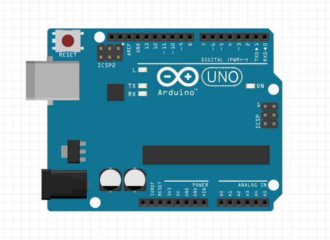

# Securino Vault

Secure vault created in arduino for school.
In collaboration with : [**@DavRide**](https://github.com/davride)

## Description

It is a double security vault. It first reads whether a security card (RFID chip) is valid and then outputs a digital code using a motor. It will be possible to change the code and block the box after **n** attempts.

## Schedule
|                |Accomplished tasks
|----------------|------------------------------------------|
|Week 1|Liste et test du matériel, création du CDC|
|Week 2||
|Week 3||
|Week 4||
|Week 5||
|Week 6||
|Week 7||
|Week 8||

## Thanks to
 & 
