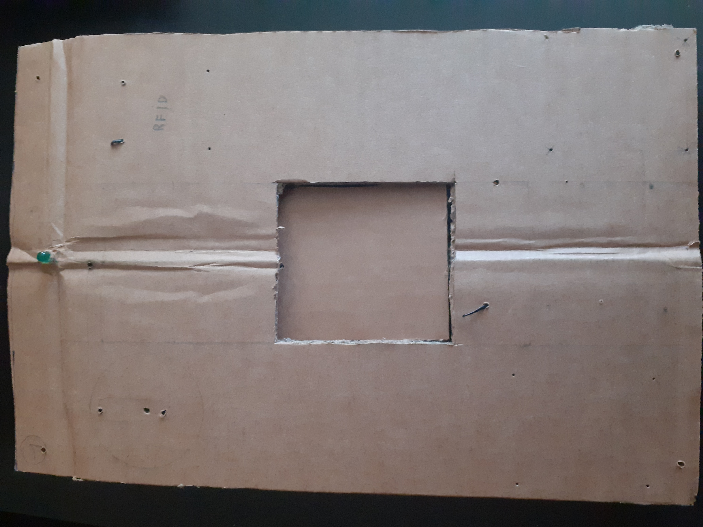
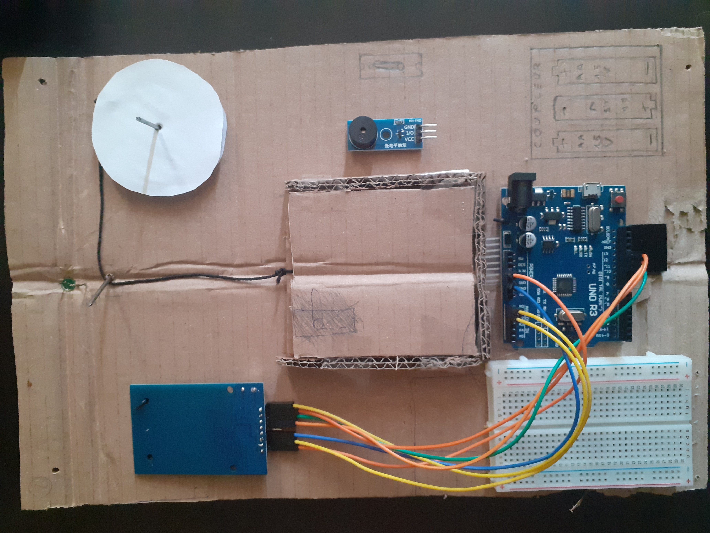
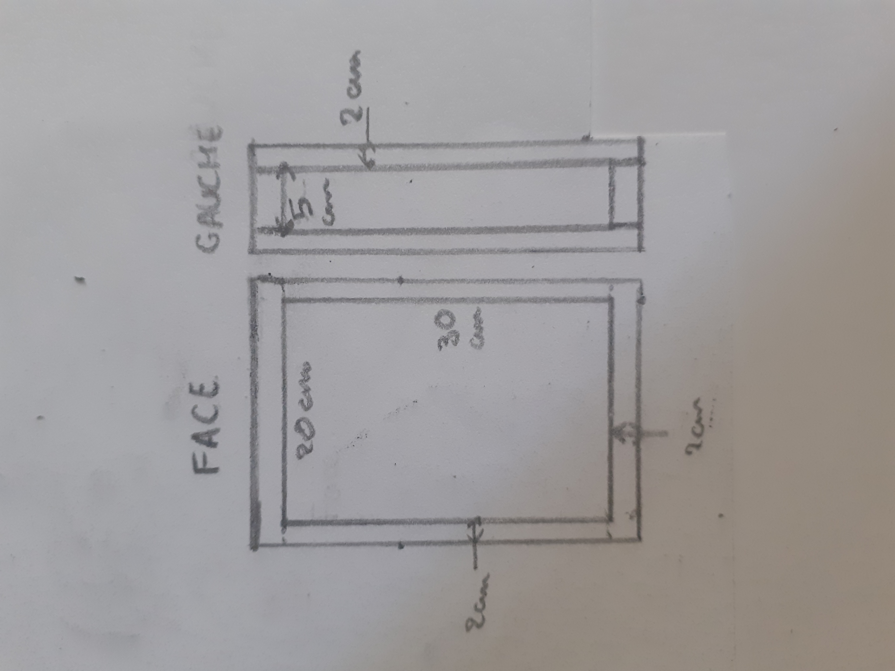

## Travail Personnel entre les séances n°2 et 3 : 19 Décembre 2023 - 7 Janvier 2024

### Récupération d'un module "Heltec LoRa 32" pour communication I2C :
#### Rappel du rapport précédent : 
- Constat d'un nombre de pins insuffisant sur la carte Arduino UNO pour pouvoir réaliser tous les branchements prévus.
- Pas de module I2C à la fin de la séance n°2, impossible de continuer ma réflexion sur le projet en dehors des séances.

Ayant prévu de continuer à travailler pendant les vacances, j'ai donc contacté un des professeurs pour pouvoir récupérer un module avant les vacances, chose faite trois jours plus tard. 

### Prise en main du module "Heltec LoRa 32" :
Recherche sur Internet du fonctionnement et de la programmation du module. Après plusieurs heures de recherche, je décide d'abandonner le module car je ne comprends pas comment adapter celui-ci à mon système, et réfléchis à une autre solution pour libérer des pins sur la carte Arduino.

### Suppression de 2 des 3 LEDS sur le coffre :
Recontage du nombre de pins utilisables, et du nombre de pins à utiliser. Je me suis rendu compte que finalement il ne nous manquait que 2 pins sur la carte pour pouvoir brancher les composants comme prévus. Ayant abandonné le module I2C, nous avons décidé de supprimer 2 des 3 LEDS prévues au départ (ainsi que 2 résistances par conséquent). Nous n'en garderons qu'une pour tout de même répondre au besoin du [Cahier des Charges](../Documentation/CahierDesCharges.md), à savoir : "Indication lumineuse et sonore lors des controles".

### Changement du sens d'ouverture de la porte :
D'après de nombreuses photos sur Internet, beaucoup de coffres semblent avoir une porte s'ouvrant à gauche avec une charnière à droite. Même si cela ne semble pas être un standard, nous avons quand-même décidé de changer le sens d'ouverture, initialement prévu vers la gauche, pour une ouverture vers la droite. Le servo dédié au mouvement du loquet sera donc placé à gauche. Le schéma donné dans le rapport précédent n'est donc plus valide, (nouveau schéma : voir plus bas).

### Système de coulisse pour le cache du clavier :
Comme expliqué dans le rapport précédent, une fois la validation RFID effectuée, un panneau cachant initialement le clavier se levera pour dévoiler celui-ci. Nous devons élaborer un système pouvant faire monter puis descendre le panneau à l'aide d'un servo moteur et d'un cable.
Après quelques temps de réflexion, j'en suis venu à la modélisation du système suivant : 

Un servo moteur, décalé par rapport à la vericale centrale de la porte, tire le cable relié au panneau, verticalement puis horizontalement grace à un axe. Le servo SG90 ne pouvant effectuer qu'une rotation maximum de 180°, nous devons donc relier le servo et le câble à une roue de diamètre suffisant pour que en une demi-rotation maximum, le cache soit completement levé. 
Sachant que la hauteur du cache (et du clavier) est de 7,6cm , et ayant besoin que la roue soit le plus petit possible, il faut donc qu'en un demi-périmètre, la corde effectue 7,6cm.  

Soit une roue de 15,2cm de périmètre et donc de **diamètre 4,9 environ arrondi à 5cm**, d'après : Périmètre = PI * Diamètre  

La retombée du cache se fera grâce à son poids et par une demi rotation du servo dans le sens inverse.
\
.
### Décalage du lecteur RFID :
Avec le déplacement du cache vers le haut, il est plus pratique de décaler le lecteur RFID pour laisser de la place au cache, sans devoir gérer la supperposition des deux.

### Alimentation : Coupleur ou simple pile ? :
N'étant pour l'instant pas sûre de comment va être alimenté le coffre, j'ai décidé de prendre le cas le plus encombrant qui est celui d'un coupleur de 3 piles AA de 1,5V chacune. Ses dimensions sont du 58 x 48 x 17 mm. Celui devra être proche de la carte car le cable n'est pas très long donc sur le bas de la porte et sur le coté gauche de manière à pouvoir changer plus facilement les piles avec l'ouverture de la porte se faisant vers la droite. Une petite trappe sur la face intérieure de la porte sera conçue pour y accéder.

### Fabrication d'une maquette taille réelle en carton :
La porte devrait être fabriquée en 2 "panneaux". Le premier qui sera la face avant, où seront attachés tous les composants, et le deuxième qui fermera le tout en étant vissé à l'arrière, depuis l'intérieur du coffre.

 

Sur les photos, ne figure que le premier panneau. Il manque les 2 servos moteur, sur la roue, et à droite (photo de droite) pour le verrou, qui devront avoir un support spécifique pour s'accrocher à la face avant. Le cablâge n'est pas complet, nous voulons juste avoir une vue d'ensemble de la disposition des composants. 

Si nous nous basons sur cette maquette, les nouvelles dimensions de la porte seraient : **(20+2x2) x (30+2x2) x (5+2x2) cm** avec des **plaques de 2 cm d'épaisseur**. Elles peuvent encore varier selon l'épaisseur des plaques de bois qui seront utilisées.

### Prochaine séance :
Nous ferons valider ou modifier notre maquette et notre système par les professeurs et leur demanderons le matériel nécessaire pour continuer notre projet.
