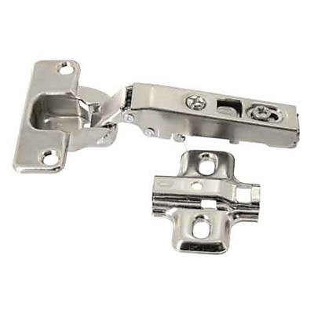

# Séance du 15 janvier 2024

## Objectifs de la Séance :
- Épaisseur du bois en fonction des vis
- Dimensions des planches. 
- Prendre Carte PCB pour souder.

## Dimensions de porte et du bois pour les panneaux  :
### Epaisseur :
Un des aspects de design du coffre, que nous avons peut-être oublié de mentionner, est qu'aucune des vis ou fixation ne soit visible depuis l'extérieur. Cela implique donc d'avoir dans l'idéal, des vis qui soient plus courtes que l'épaisseur de la planche de bois dans laquelle elles seront vissées (depuis l'intérieur). Or étant prévu que la porte soit déja assez épaisse, par l'architechture interne et la taille des composants, il serait préférable que nous puissions minimiser l'épaisseur des planches qui la constitueront. 

Etant donné que les épaisseurs de planches disponibles étaient 3mm, 5mm et 10mm, et que si je décidais de prendre une planche de 5mm d'épaisseur, il m'aurais fallu des vis au moins plus courtes que 5mm. En demandant à un professeur, il m'a assuré qu'il n'y avait pas ce que je cherchais et que de plus, je risquais de rencontrer des difficultés pour faire rentrer et tenir la vis dans le bois, avec de si petites dimensions. 

Il m'a plutôt conseillé d'utiliser du **scotch double face** ou bien de la **bande Scratch** pour **fixer les composants** sur le bois. Je vais donc envisager cette option là, ce qui va me permettre de prendre une **plaque plus fine**, sûrement **3mm d'épaisseur** pour la face avant, **10mm d'épaisseur** pour l'arrière (voir **Largeur coffre et Charnières** ci-dessous) , et **5mm d'épaisseur** pour les cotés. 

### Longueur et largeur :
On rajoute aux dimensions nécessaires pour la disposition des composants, les épaisseurs des planches sur les flancs, à savoir deux fois 5mm.

### Dimensions totales :
**La porte devrait donc mesurer : 30 x 21 x 5.3 cm**
- Hauteur : 30 cm = 0,5 + 29 + 0,5 cm
- Largeur : 21 cm = 0,5 + 20 + O,5 cm
- Epaisseur : 5,3 cm = 0,3 + 4 + 1 cm

## Largeur coffre et Charnières :
Un autre aspect recherché est qu'il n'y ai pas de charnières visibles ou visées depuis l'exterieur ce qui nuirrait fortement à l'esthétique et à la sécurité. J'ai mis la main sur des **charnières "invisibles"** utilisées pour les meubles de cuisine par exemple, qui seront vissées depuis l'intérieur du coffre.
 
 

Pour ça, il faut prévoir que la porte et le meuble (ici, le coffre) fassent la même largeur. Donc, on sait déjà que le **coffre fera 21 cm de largeur**. De plus, l'épaisseur des planches de bois utilisées pour faire les cotés du coffre, devront être de 2cm d'épaisseur pour accueillir les fixations des charnières. 

Pour assurer la solidité de l'attache, il est préferable de prendre une **plaque plus épaisse pour le panneau arrière**, au risque que celui-ci se déchire sous la force des charnières, quand on ouvrira la porte. **Au lieu de 3mm nous prendrons du 10mm d'épaisseur**, sur lequel nous mettrons les charnières, fixées avec vis et boulons. 

### RFID à travers le bois :
Etant prévu que le capteur RFID soit à l'intérieur du coffre, il faut que celui-ci puisse lire une information donnée par un badge à l'extérieur, donc à travers le bois. Après vérification, la lecture a correctement fonctionné à travers du bois de 3mm d'épaisseur.

### Assemblage du bois en "puzzle" :
Il m'a été conseillé, lorsque je ferai découper le bois, de le faire avec un logiciel qui découpera les plaques en "puzzle", de manière à ce qu'elles puissent s'emboiter et tenir ensemble plus facilement. Nous devons encore y réflechir, le problème étant le fait que nous ne sommes pas sûre que la porte reste en place au moment où l'on tira dessus.

### Carte PCB pour soudure :
Je n'ai pas pris de le temps de m'en occuper malheureusement, mais je sais qu'il y en a en stock et que je pourrai m'en occuper la prochaine fois.
