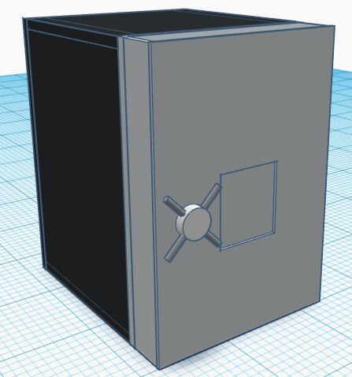
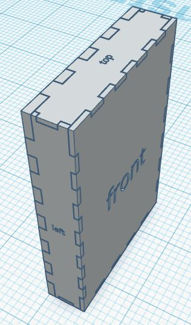
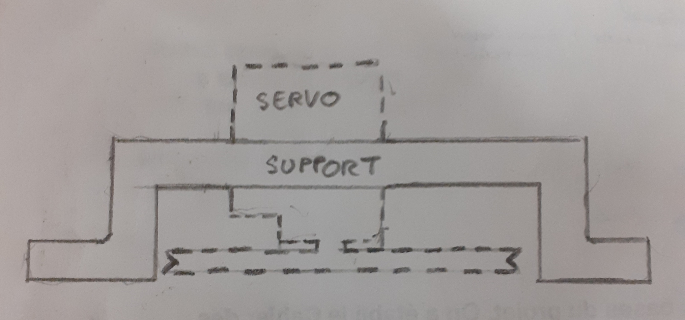
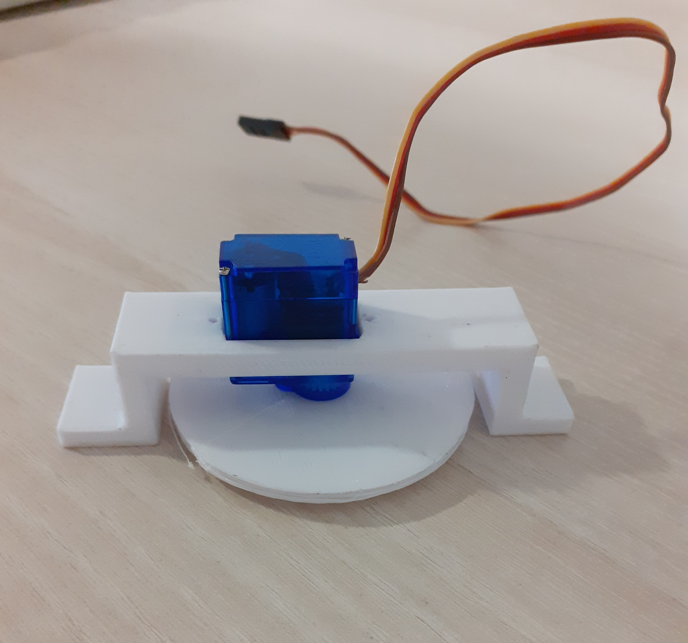

# Séance 5 : Semaine du 22 janvier 2024

## Objectifs de la Séance :
- Modéliser et découper les planches de bois du coffre
- Placer les composants dans la porte
- Prendre Carte PCB pour souder.

## Modélisation et découpe des planches de bois  :
### Modélisation du coffre :
Pour avoir une vision plus concrète de ce à quoi allait ressembler le coffre, j'ai décidé de le modéliser en 3D. J'ai d'abord modélisé, dans **Tinkercad**, la porte puis le reste du coffre, le tout en fonction des dimensions données la semaine dernière. J'ai entre temps décidé que la **profondeur** du coffre sans la porte, serait de **20cm**. Le but est d'éviter qu'il soit disproportionné par rapport à la porte, mais ausssi trop profond pour qu'il ne prenne pas trop de place et trop de bois. Pour la modélisation simple j'ai donc utilisé Tinkercad qui m'a permis d'aller très vite, et d'avoir le tout en différentes pièces.
 
 

Une manivelle sera sûrement présente sur le coffre pour pouvoir ouvrir le coffre. Etant donné que nous comptons utiliser des charnières invisibles, l'ouverture nécessitera un minimum de force et de couple. Elle devra donc être attachée sur le panneau arrière car il est plus épais/résistant que le panneau avant, ce qui réduira le risque de casse au moment où l'on tira dessus.

Une fois les mesures vérifiées , j'ai continué avec la modélisation des planches (de bois) de la porte, qui seront découpées au laser en vrai. Pour cela j'ai utilisé le site **MakerCase** pour générer une boite qui représente la porte. Comme je ne pouvais pas modifier une par une les épaisseurs des cotés, j'ai fait ma porte avec des planches de 5mm dépaisseur, disposants d'encoches, puis j'ai ouvert le fichier SVG généré par MakerCase dans Tinkercad pour pouvoir ajuster facilement la taille des encoches avec celles des épaisseurs de la face avant (3mm) et la face arrière (10mm).

Ensuite, j'ai fait la même chose pour le reste du coffre en faisant une boîte ouverte avec les cotés de 20mm d'épaisseur sur les côtés gauche et droit et 10mm pour le reste. 
A ça j'ai ajouté le trou et support du cache de clavier qui seront aussi attachés avec un système d'encoches, fait à la main cette fois.

Il était question de mettre une planche dessous qui soit plus épaisse pour accueiller des vis qui fixeraient des pieds, mais ça ne sera pas nécessaire car nous collerons des patins à la place.

### Découpe des planches :
Une fois la modélisation terminée, j'ai pu demander à un professeur pour que l'on puisse faire découper les planches avant la séance du Vendredi. Je n'ai d'abord fait découper que les pièces d'épaisseur 3 et 5mm (la porte sans le panneau arrière), pour vérifier qu'il n'y ait pas de problème et que les composants se plaçaient bien. Quant au reste du coffre, je n'ai pas fait découper les plaques de 10mm d'épaisseur le jour de la séance comme je l'avais prévu, car j'ai du revoir le système de fermeture qui nécessitera surement de faire une découpe précise dans certaine(s) planche(s).

## Placement des composants :
### Modélisation d'un support de servo moteur :
Pour fixer à la porte le servo controlant la montée et descente du cache clavier, il fallait modéliser un support spécifique pour que celui-ci soit accroché au panneau avant. Afin que la traction puisse se faire au mieux, l'enrouleur fixé sur l'axe du servo doit être aligné par rapport au plan de trajectoire du cable , il est donc nécessaire de retourner le servo moteur par rapport au panneau . De plus, le support ne doit pas dépassser de la porte et doit aussi prendre en compte, la largeur et la hauteur de l'enrouleur ainsi que celle du servo. 

Après rélexion, j'ai finalement modélisé et imprimé la pièce suivante :  

 

## Soudage sur carte PCB :
Afin d'alimenter tous les composants, il est néccessaire que nous disposions soit d'une Breadboard, soit d'une carte PCB à souder, pour y faire les connexions 5V et GND. J'ai pu avoir une de ces cartes sur laquelle j'ai passé pas mal de temps. Par manque d'expérience et peur de faire une bétîse, j'ai longuement hésité au placement des fils et des résistances que je n'ai pas fini de souder, chose que je devrai finir la prochaine fois.

## Système de vérouillage physique du coffre :
Dans la continuité de ma réflexion sur certaines caractéristiques du coffre, je me suis repenché sur le système de vérouillage physique avec le servo moteur. La porte faisant toute la largeur du coffre et le servo devant êre fixé au panneau avant, je pensais initialement faire dépasser un embout relié au servo moteur qui serait venu se loger dans le coté du coffre. Or cela impliquait que le support de servo ou l'embout soit d'une assez grande hauteur pour traverser toute la porte. Dans les deux cas, cela aurait engendré une forte contrainte et surement une casse, si l'on venait à tirer sur la porte du coffre vérouillé. 

A la place, je pense mettre sur le flanc des planches gauche du coffre, soit une **platine à oeil** soit un **piton à visser / "vis à anneau"**. Un embout (modélisé en 3D) en forme de crochet, attaché au servo, viendrait se mettre dans l'anneau fixé à la planche, pour vérouiller la porte et ça de manière plus solide. J'ai demandé à un professeur si il disposait d'une platine à oeil ou d'un piton à visser mais il m'a répondu que non. Je devrai donc soit m'en procurer, soit modéliser la pièce et l'imprimer en 3D.

