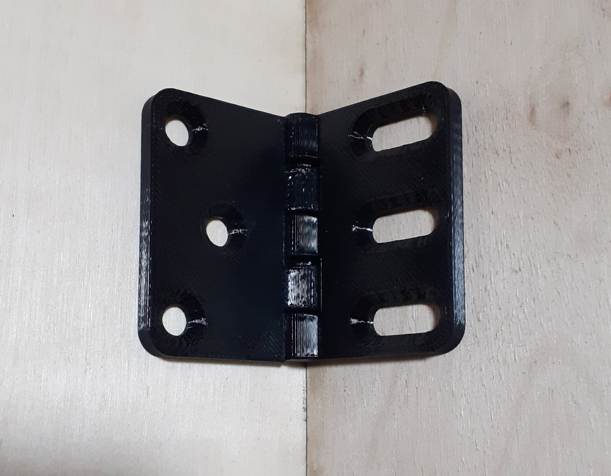
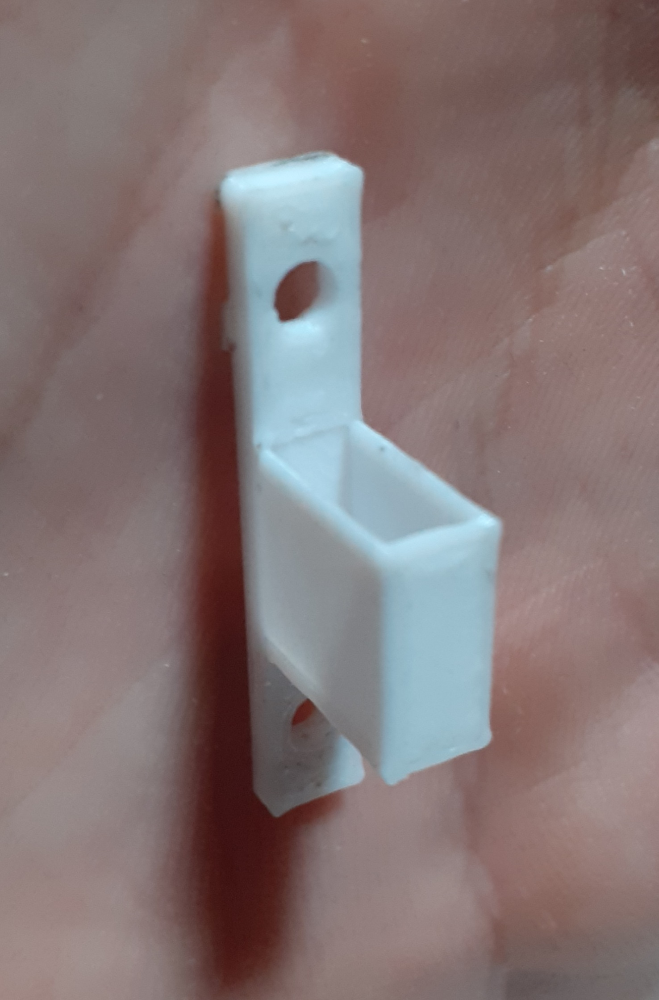
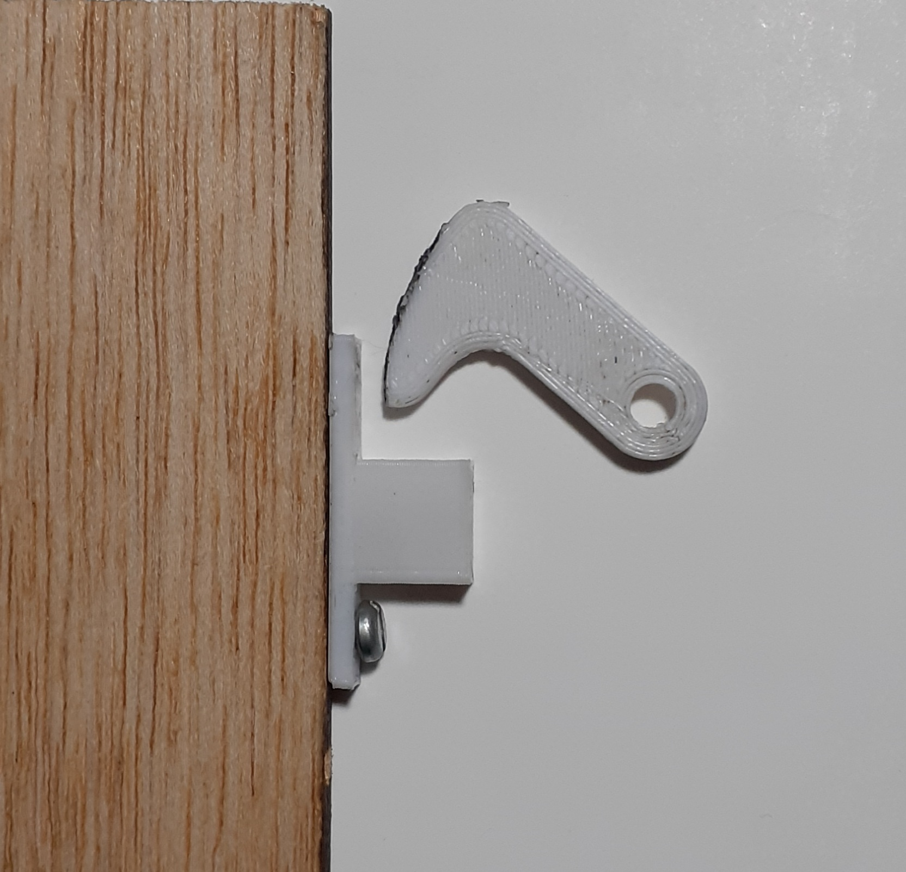

# Séance 7 : Semaine du 9 février 2024

## Objectifs de la Séance :
- Terminer soudage carte PCB.
- Découper les planches de bois du coffre.
- Assemblage et fixation des charnières.

## Soudage de la carte PCB 
Entre les deux séances, je suis venu sur mon temps libre pour continuer et même terminer les soudures des fils sur la carte PCB. 
J'y ai passé au total **2H30**, en plus du créneau de la séance de la semaine dernière, pour tout terminer, ce qui était bien au-dela de ce que je pensais initialement. 
J'ai pris le soin à la fin des soudures de faire des **tests de continuité** pour savoir si le courant être délivré correctement aux composants, mais aussi en m'assurant qu'il n'y ait **pas de court-circuit entre le 5V et le GND**. Le résultat serait plus qualifiable de "faisceau électrique" que de carte PCB mais nous avons pu l'installer dans la porte le jour de la séance et celui-ci **fonctionne correctement avec le programme**.

## Découpe des planches de bois du coffre - Refonte totale du coffre 
### Problèmes :
Durant la semaine, je suis aussi venu au FabLab pour y faire découper les planches de bois pour le coffre, mais au moment de mettre les fichiers dans le logiciel deux problèmes sont apparus :

Le premier étant des **dimensions** prévues pour le reste du coffre **très/trop grandes et surtout par rapport au taille des planches** disponibles. Mais ce problème n'était pas "grave" en-soi, juste ennuyant par rapport à l'utilisation dispensable d'autant de bois.

Le deuxième problème était que je voulais initialement faire découper sur du bois de 1cm d'épaisseur et faire les cotés du coffre avec 2cm d'épaisseur (voir rapports précédents). Or contrairement à ce que pensais tout au long du projet, il n'y avait **pas de plaque de 1cm d'épaisseur**, que 0,3cm et 0,5cm. Il aurait fallu découper 4 fois les mêmes plaques de 0,5cm pour un seul côté.

Le deuxième problème amplifie le premier, faisant que la consommation de bois allait être excessive et j'ai donc abandonné la découpe et dû revoir quasiment entièrement le modèle du coffre par rapport à sa taille et les épaisseurs de planches. Une "chance" de m'en être aperçu bien avant la séance.
Une autre "chance" est qu'en remodélisant le coffre, je me suis rendu compte que **la fixation des charnières prévue initialement aurait elle aussi posé problème**. Le fait que la porte et les côtés soit d'épaisseurs différentes, aurait provoqué soit une butée de la porte soit un désalignement par rapport au reste. Les charnières invisibles prévues initialement ne pouvant être utilisées, j'ai décidé de faire un système de remplacement (voir plus bas).

### Changement des dimensions :
Les **épaisseurs des cotés** passent de **1cm au lieu de 2cm** avec de plaques de 0,5 cm collées. La **profondeur du coffre est de 10cm au lieu de 20cm** pour mieux rentrer sur les plaques de découpe.

### Modélisation des charnières :
Pour résoudre le problème de charnires, j'ai pris un modèle 3D de charnières sur le site **Thingiverse** auquel j'ai élargie horizontalement les trous du coté droit de 1cm pour que les vis et la porte puissent faire une translation par rapport aux charnières et ensuit que la porte s'ouvre normalement, sans butter contre le coffre.

### Changement du système de loquet :
Avec le changement d'épaisseur, j'ai décidé de remplacer la vis à anneau par une pièce imprimée en 3D, qui se vissera sur le coté du bois de 5mm d'épaisseur, la vis ne le permettant pas. 

A la fermeture, le crochet (que j'ai du usiner pour qu'il rentre), viendra se bloquer dans la fente et immobiliser la porte. Un trou dans le panneau arrière de la porte a été fait pour que la porte puisse glisser sans toucher le loquet lorsqu'elle est dévérouillée.

### Découpage et Tests :
Découpage de seulement 2 épaisseurs de cotés et des planches haut/bas. La machine était ensuite réservée par d'autres personnes, et je n'ai pas pu continuer, ce qui fait que je n'avancerai pas aussi vite que prévu. En attendant , j'ai fait des **tests de perçage, vissage et de fonctionnement sur des chutes bois, pour la serrure et les charnières** et ces tests se sont avérés **concluants**. 

Je ferai les découpes dès la semaine prochaine pour tout régler et ne pas être en retard lors de la dernière séance.
