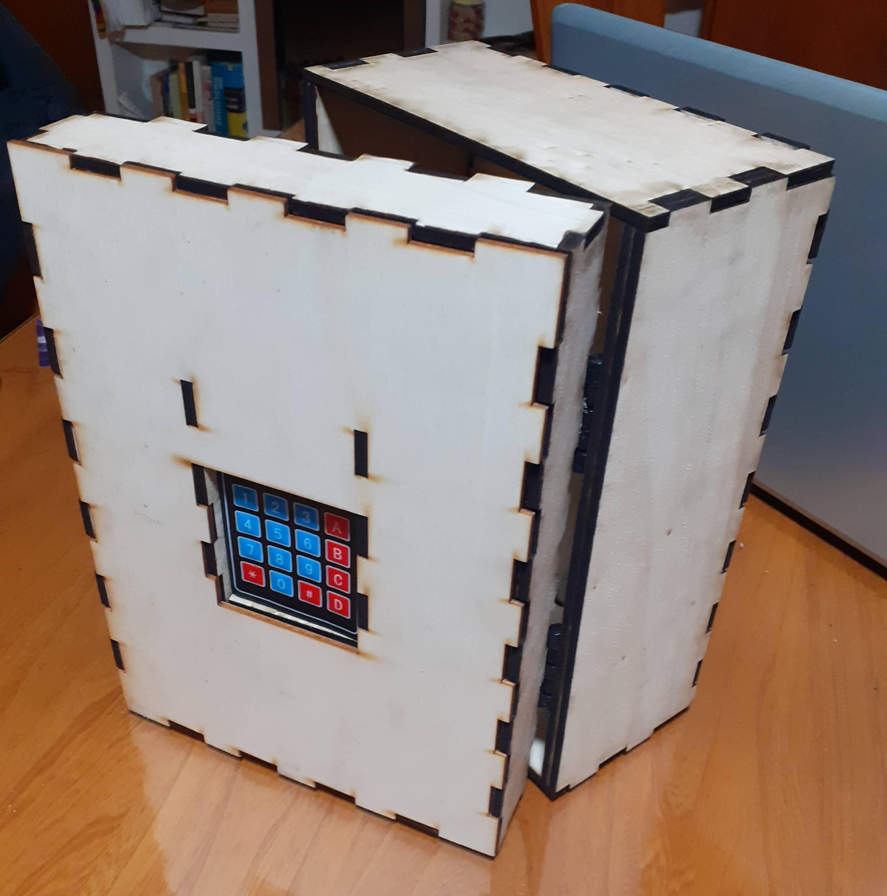

# Séance 8 : Semaine du 23 février 2024

## Objectifs de la Séance :
- Découper les dernières planches de bois et assemblage du coffre.
- Positionnement et fixation des éléments.

## Découpage des dernières planches de bois :
Durant la semaine, certains de mes camarades et moi avons pu confier les modèles de nos pièces aux professeurs du FabLab, pour que celles-ci puissent être découpées  en avance et que nous puissions les avoir avant la séance de projet. Après avoir récupéré mes pièces/planches découpées, j'en ai assemblé l'entièreté pour vérifier qu'elles s'emboitent correctement les unes dans les autres et avoir un aperçu réel du coffre. 

 

Il a tout de même fallu ajuster la taille des encoches sur une partie arrière de la porte en les raccoursissant de 10mm à 5mm de largeur. Comme nous avons changé nos charnières par d'autres requierant moins de force, il n'était plus nécessaire d'avoir 10mm d'épaisseur sur le panneau arrière, 5mm suffisant largement pour résister à la force lors de l'ouverture.

## Positionnement et fixation des éléments :
### Loquet de la porte :
Dans les dernières pièces qu'il restait à découper, il y avait le panneau arrière de la porte, dans lequel j'avais prévu un trou pour le passage du loquet et son coulissage lors de l'ouverture de la porte. 

J'ai donc du mesurer la hauteur du trou pour ensuite déterminer l'emplacement où allait se trouver le loquet, pour le fixer sur le flanc d'une des plaques 5mm constituant le coté du coffre. J'ai percé un trou à l'endroit prévu et j'y ai vissé la pièce.

### Alignement du servo de la serrure :
Il a ensuite fallu positionner le servo au bon endroit dans la porte, pour qu'en position fermée/vérouillée, le crochet qui y est attaché, vienne se placer correctement dans le loquet du coffre. 

### Usinage et vissage des charnières :
Les charnières imprimées la semaine précédente, ont dû être **(ré)usinées** car la longueur des fentes dans lesquelles les vis devaient coulisser, n'était pas suffisante pour que l'on puisse ouvrir la porte complètement. 

J'ai donc pris une **Drémel**, avec laquelle j'ai **prolongé les fentes vers l'intérieur des charnières**, jusqu'à obtenir une longueur suffisante. Le problème suivant a été que mon usinage n'était pas très précis et qu'à force de percer, la largeur des fentes à cet endroit est devenue trop grande et que **les têtes de vis pouvaient passer à travers les charnières**, faisant que la porte aurait pu se décrocher dans le futur. J'ai donc mis des **rondelles sur les vis**, hors celles-ci étant assez large pour corriger le problème précédent, elles sont venues **buter contre la partie intérieure des charnières**, et donc empécher le mouvement restant des vis et par conséquent l'ouverture complète de la porte.
J'ai **usiné là aussi la partie où venaient buter les rondelles** pour laisser plus d'espace, ce qui fait désormais que ça fonctionne mais parfois les rondelles viennent se bloquer dans les fentes et bloquer/rendre difficile le mouvement d'ouverture. 

Si j'ai le temps pendant les vacances, je vais peut-être  **modéliser des rondelles ou capuchons de vis** en forme de rectangle à imprimer en 3D, qui viendraient cette fois se mettre sur la tête des vis; le but étant de fiabiliser le système.

### Autres composants :
J'ai fixé les autres composants à la porte temporairement avec du scotch type Gaffer, mais ici pas de nouvelles problématiques particulières.

## Taches à réaliser pendant les vacances :
<li> Modélisation d'une poignée de porte </li>
<li> Modélisation des capuchons de vis pour les charnières </li>
<li> Test du système entièrement assemblé et rectifications si nécessaires </li>
<li> Fixation pseudo-définitive de l'ensemble des planches et composants </li>
<li> (Optionnelle) Peinture en noire du coffre </li>
