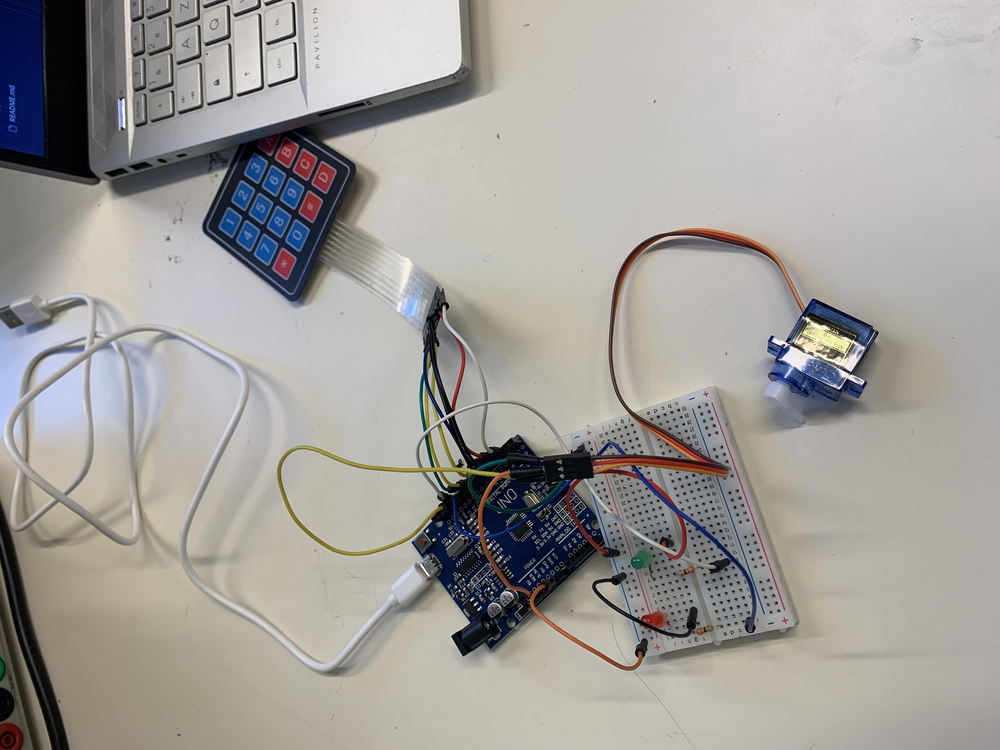

*******************
# Rapport 
*******************

## Séance du 18 Décembre

- **Début du code**
  La séance a commencé par l'initiation du code pour le système de digicode.

- **Test des fonctions du code**
  Les différentes fonctions du code ont été testées, couvrant l'interaction homme-machine, la gestion des LEDs et du servo-moteur.

- **Implémentation des fonctions**
  Plusieurs fonctions ont été implémentées pour assurer le bon fonctionnement du digicode :

  - **A : Réinitialiser l'input du code**
  - **B : Verrouiller le coffre**
  - **C : Changer le code** (uniquement lorsque le coffre est déverrouillé)
  - **D : Valider le code entré**

- **Toutes ces fonctions marchent**
  Les tests ont confirmé que toutes les fonctions ont été implémentées avec succès, et le code correspondant est disponible dans la documentation.

- **Configuration de la breadboard et reflexion autour du nombre d'I/O**
  Nous avons réalisé qu'il allait nous manquer des I/O sur la carte arduino uno. Nous avons alors essayé de trouver une solution. Premierement, on a pensé a prendre un arduino mega mais considérant cette méthode trop "bourrine" nous nous pencherons alors sur une solution visant a réduire le nombre de pin mobilisés du lecteur RFID mais aussi du digicode grace au protocole i2s.
  
- **Problème avec l'Arduino**
  Malheureusement, l'Arduino a été endommagé lors de la séance, car le servo-moteur était connecté à la sortie 5V de la carte Arduino. Les tests ont été interrompus vers 15h45.

- **Solution pour les prochaines séances**
  Pour les séances à venir, il a été décidé de prototyper en utilisant l'Arduino de M. Bermon afin d'éviter les problèmes liés à la surtension.

