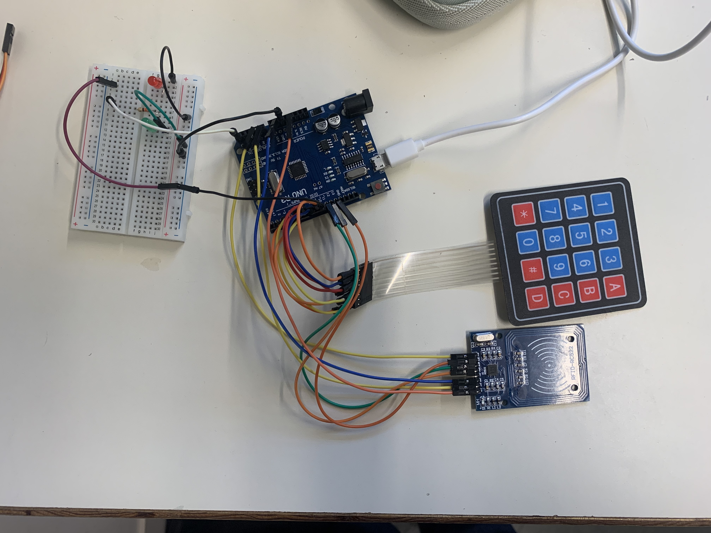

*******************
# Rapport 
*******************

## Séance du 22 Décembre

### Code

Au cours de cette séance, j'ai concentré mes efforts sur la partie code, cherchant à implémenter toutes les fonctions requises avec l'ensemble des composants. Cela inclut la gestion de l'accès au digicode uniquement si le tag RFID est validé, ainsi que le contrôle des LED. J'ai mis en œuvre des optimisations afin d'améliorer l'efficacité globale du code.

Suite à une réflexion, je considère probablement abandonner l'utilisation des variables d'état, car le fonctionnement actuel du code semble satisfaisant et ne nécessite pas de changement majeur. Cependant, nous conserverons l'état de la porte verrouillée ou non pour la gestion des LED.

Pour la séance suivante, je prévois de me pencher sur l'intégration des servo-moteurs et leur mise en œuvre dans le code. Aujourd'hui, j'ai principalement utilisé la fonction `print` pour afficher l'état de la porte, mais la prochaine étape consistera à opérationnaliser les servo-moteurs dans le système.

